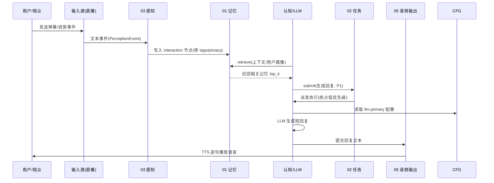
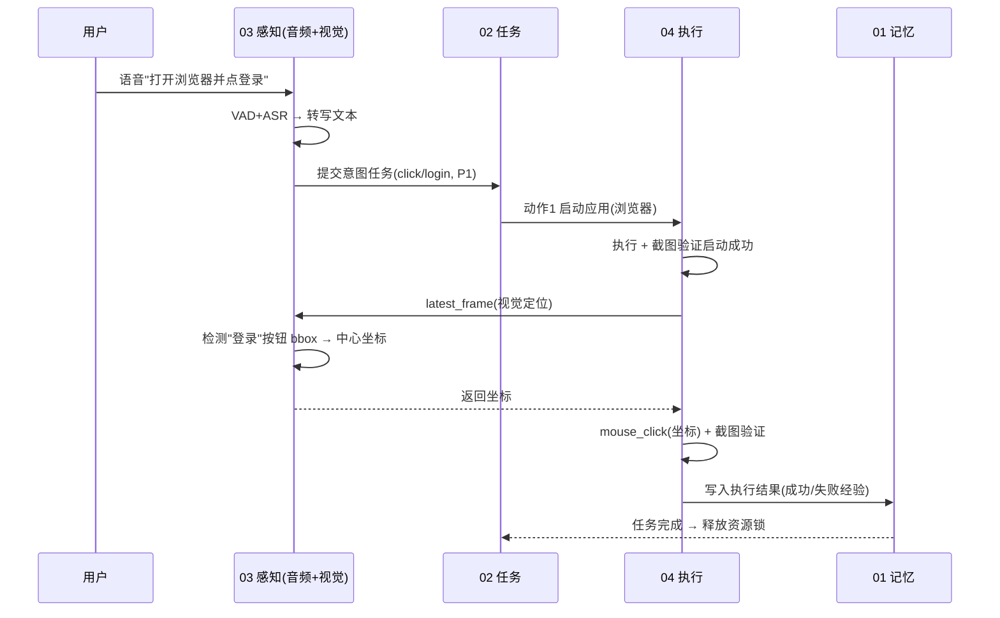
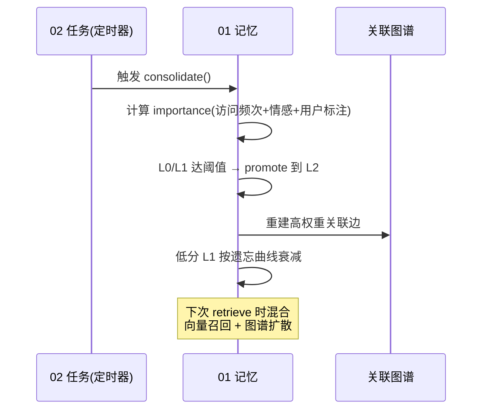

# 06 端到端场景与数据流

> 本文件用三个具体场景把 01~05 五大子系统串成可落地的闭环，验证架构设计在真实链路上的自洽性。

参与者简称：用户(U)、输入源(IS)、03 感知(P)、01 记忆(M)、认知/LLM(C)、02 任务(T)、04 执行(X)、05 音频输出(O)、05 配置(CFG)。

---

## 场景 A：直播弹幕实时回复（沿用现有 ABILITIES，P1 优先级）



**关键点**：① 记忆召回保证角色一致性；② P1 任务有最大等待时间，直播响应不饿死；③ LLM 不可用时走本地规则兜底（见 00 降级规则）。

---

## 场景 B：跨模态指令执行（"打开浏览器并点登录按钮"）



**关键点**：① 语音→文本→任务→执行 全链路 `trace_id` 贯通；② 执行层依赖感知层 `latest_frame` 做坐标解析（语义目标→像素）；③ 动作受权限分级约束，`ui` 级需会话授权；④ 执行后回看验证，失败触发重试。

---

## 场景 C：记忆巩固与召回（系统空闲/会话结束触发）



**关键点**：① 分级流转自动发生，无需人工搬运；② 图谱随巩固更新，召回质量随使用提升；③ 隐私标记 `secret` 不进入公开召回。

---

## 跨场景通用数据流（一句话）

```
输入 → 感知(结构化) → 记忆(存/取) → 认知(LLM 决策) → 任务(排序) → 执行(操控) → 输出(语音)
                                          ↑________执行反馈回流记忆________↓
```

## 设计自洽性检查

| 检查项 | 结论 |
|--------|------|
| 任一子系统能否独立替换？ | 能。均经 05 配置 + 统一接口解耦 |
| 单点故障是否拖垮全局？ | 否。00 失败隔离 + 降级路径 |
| 敏感操作是否受控？ | 是。04 权限分级 + 二次确认 + 审计 |
| 记忆能否支撑角色一致性？ | 能。L2 用户画像 + 关联召回 |
| 多输入源能否并存？ | 能。05 命名实例，多源并行采集 |
