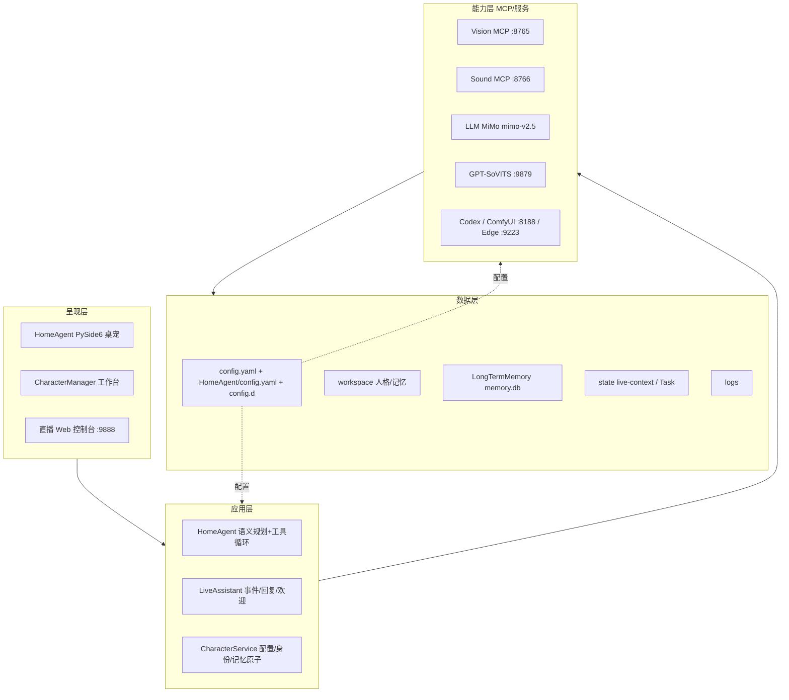

# AI Agent 系统架构（记录版 · 已整合真实实现）

> 本目录是「一个可操控电脑的 AI Agent」的架构记录。它把最初的**绿地框架设计**（`00–07`）与 `E:\Doc\AIAgent\AI Read` 中的**真实系统实现**（`AI Read 00–08`）整合为单一事实来源。
> 设计理念（分层、关联性记忆、模型驱动执行）保留；与真实实现的差异与「设计演进」目标统一记录在 `08_实现对照.md`。

---

## 0. 一句话定位

Windows 本地 AI 角色运行平台：同一角色在 **B站直播 / 家庭桌宠 / 桌面自动化** 三场景工作，共享身份、人格、语音与隐私隔离的长期记忆。底层由 **MiMo `mimo-v2.5` 语义规划**驱动，**Vision/Sound 走 MCP（`:8765`/`:8766`）**，记忆为 **live-context / 每日 JSONL / SQLite 三层**，配置为 **双 YAML + `config.d` 拆分**。

> **最高优先级规则**：任务类型与任务流程**禁止硬编码**——意图/步骤/工具选择/完成判断全部由大模型决定，本地仅校验参数。

---

## 1. 文档地图

| 编号 | 文档 | 职责 | 对应真实实现（AI Read） |
|------|------|------|--------------------------|
| 00 | [设计规则与总原则](./00_设计规则与总原则.md) | 通用规则、接口契约、安全边界 | AI Read 00/05 硬性约束 |
| 01 | [记忆分级关联性系统](./01_记忆分级关联性系统.md) | 分级存储 + 关联检索 | AI Read 04 数据/记忆 |
| 02 | [任务排序系统](./02_任务排序系统.md) | 模型驱动语义规划 + 调度机制 | AI Read 01/06 任务执行 |
| 03 | [视觉与音频识别系统](./03_视觉与音频识别系统.md) | 多源感知 + 结构化输出 | AI Read 02/03 组件与接口 |
| 04 | [模拟输入系统](./04_模拟输入系统.md) | 模拟键鼠/系统操控电脑 | AI Read 02/03 组件 |
| 05 | [设置接口与参数系统](./05_设置接口与参数系统.md) | 输入源/LLM/音频输出配置中枢 | AI Read 03 接口与配置 |
| 06 | [端到端场景与数据流](./06_端到端场景与数据流.md) | 三场景串联五大系统 | — |
| 07 | [接口契约参考](./07_接口契约参考.md) | 全系统 API/数据模型单一事实源 | AI Read 03/07 |
| 08 | [实现对照](./08_实现对照.md) | **设计 ↔ 真实代码 逐项对照 + 状态** | AI Read 00–08 |
| — | [架构图.svg](./架构图.svg) | 融合真实实现的分层架构图 | — |
| — | `config/` | `settings.schema.yaml`(约束) / `settings.example.yaml`(示例) | — |

---

## 2. 系统总览（分层数据流）



> 更精确的端口/模块图见 `架构图.svg`；设计↔实现差距见 `08_实现对照.md`。

---

## 3. 阅读顺序建议

1. 先读 `00_设计规则与总原则.md` —— 含最高优先级「禁止硬编码任务类型」规则。
2. 再读 `08_实现对照.md` —— 一眼看清哪些已实现、哪些是设计演进。
3. 按数据流：`03 感知` → `01 记忆` → `02 任务（模型驱动）` → `04 执行` → `05 配置`。
4. 接口/字段权威定义看 `07_接口契约参考.md`；落地链路看 `06_端到端场景与数据流.md`。

---

## 4. 目录结构

```
架构/
├── README.md                      # 本文件：整合索引与映射
├── 00_设计规则与总原则.md          # 跨系统规则、接口契约、安全边界
├── 01_记忆分级关联性系统.md
├── 02_任务排序系统.md
├── 03_视觉与音频识别系统.md
├── 04_模拟输入系统.md
├── 05_设置接口与参数系统.md
├── 06_端到端场景与数据流.md
├── 07_接口契约参考.md
├── 08_实现对照.md                 # 设计 ↔ AI Read 真实实现 对照
├── 架构图.svg                     # 融合真实实现的分层架构图
└── config/
    ├── settings.schema.yaml       # 配置字段约束
    └── settings.example.yaml      # 示例配置
```

---

## 5. 设计基调（一句话）

> **模型驱动、分层解耦、记忆为核、配置中枢、安全兜底**——任务排序由语义规划器决定，能力经 MCP/配置可热插拔，记忆跨场景隐私隔离，敏感操作受权限与审计约束。

---

## 6. 信息优先级（改动时遵循）

`当前代码与 YAML` > `AI Read 00–08` > `本目录 00–08` > `README`。修改代码/配置须同步 `AI Read` 对应章节；本目录作为架构记录版，侧重"为什么这样设计"与"设计↔实现差距"。
